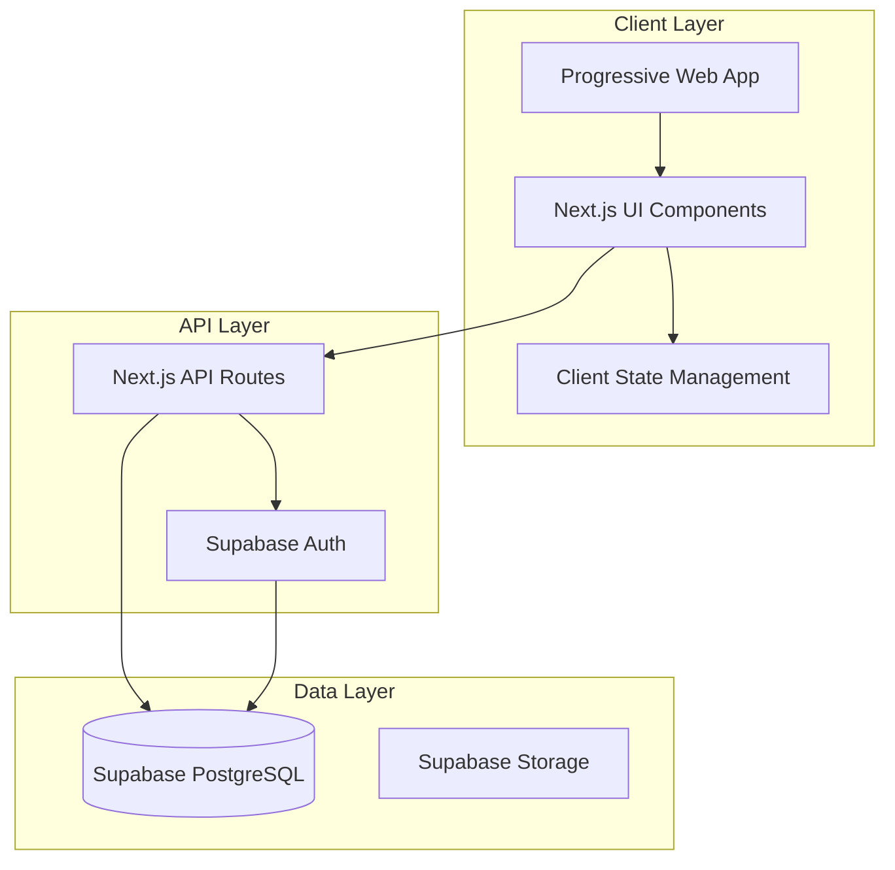

# Design Document: Glance Money

## Overview

Glance Money is a mobile-first Progressive Web Application built with Next.js 14 (App Router), Tailwind CSS, and Supabase. The application follows a responsive design philosophy where mobile experience drives the design decisions, with desktop layouts as enhanced versions of the mobile interface.

The core architecture emphasizes simplicity, performance, and immediate visual feedback through dynamic theming based on financial status. The application uses a component-based architecture with server-side rendering for optimal performance and SEO.

## Architecture

### High-Level Architecture



### Technology Stack

- **Frontend Framework**: Next.js 14 with App Router for file-based routing and server components
- **Styling**: Tailwind CSS with mobile-first responsive design utilities
- **UI Components**: Shadcn UI for consistent, accessible component library
- **Icons**: Lucide React for lightweight, consistent iconography
- **Database**: Supabase PostgreSQL with real-time subscriptions
- **Authentication**: Supabase Auth with social providers
- **Deployment**: Vercel for optimal Next.js performance
- **PWA**: Next-PWA plugin for offline capabilities and app installation

### Responsive Design Strategy

The application uses Tailwind's mobile-first approach:
- Base styles target mobile (320px+)
- `md:` prefix for tablet/desktop (768px+)
- `lg:` prefix for large desktop (1024px+)

## Components and Interfaces

### Core Layout Components

#### 1. ResponsiveLayout Component
```typescript
interface ResponsiveLayoutProps {
  children: React.ReactNode;
  currentPage: 'home' | 'transactions' | 'goals' | 'settings';
}
```

**Mobile Layout (default)**:
- Fixed bottom navigation bar
- Main content area with safe padding
- FAB positioned for thumb accessibility

**Desktop Layout (md:+)**:
- Sidebar navigation or top navbar
- Grid-based content layout
- Enhanced spacing and typography

#### 2. BottomNavigation Component
```typescript
interface BottomNavigationProps {
  currentPage: string;
  onNavigate: (page: string) => void;
}
```

**Features**:
- Four main tabs: Home, Transactions, Goals, Settings
- Active state indicators
- Touch-optimized 44px minimum height
- Hidden on desktop (`md:hidden`)

#### 3. FloatingActionButton Component
```typescript
interface FABProps {
  onClick: () => void;
  variant: 'primary' | 'secondary';
  position: 'center-bottom' | 'bottom-right';
}
```

**Positioning**:
- Mobile: Center of bottom navigation or bottom-right corner
- Desktop: Bottom-right corner with larger size

### Dashboard Components

#### 1. NetStatusCard Component
```typescript
interface NetStatusCardProps {
  netAmount: number;
  currency: string;
  locale: 'th' | 'en';
  theme: 'positive' | 'negative';
}
```

**Responsive Behavior**:
- Mobile: Full-width hero card with large typography
- Desktop: Prominent card in grid layout with additional metrics

#### 2. SummaryCards Component
```typescript
interface SummaryCardsProps {
  income: number;
  expenses: number;
  goals: GoalSummary[];
  categories: CategorySummary[];
}
```

**Layout**:
- Mobile: Vertical stack with horizontal scroll for categories
- Desktop: Grid layout (2-4 columns based on screen size)

#### 3. TransactionList Component
```typescript
interface TransactionListProps {
  transactions: Transaction[];
  onEdit: (id: string) => void;
  onDelete: (id: string) => void;
  groupBy: 'date' | 'category';
}
```

### Transaction Management Components

#### 1. TransactionForm Component
```typescript
interface TransactionFormProps {
  mode: 'create' | 'edit';
  initialData?: Partial<Transaction>;
  onSubmit: (data: TransactionData) => void;
  onCancel: () => void;
}
```

**Form Structure**:
- Income/Expense toggle (prominent at top)
- Amount input (large, numeric keypad on mobile)
- Category selector (icon-based grid)
- Description field (optional)
- Date picker (defaults to today)
- Recurring checkbox

#### 2. CategorySelector Component
```typescript
interface CategorySelectorProps {
  selectedCategory: string;
  onSelect: (category: string) => void;
  categories: Category[];
}
```

**Categories**:
- Food: 🍽️ (Restaurant/Grocery)
- Transport: 🚗 (Gas/Public Transport)
- Fixed Cost: 🏠 (Rent/Utilities)
- DCA: 📈 (Investment/Savings)

### Goals Management Components

#### 1. GoalsOverview Component
```typescript
interface GoalsOverviewProps {
  goals: Goal[];
  onCreateGoal: () => void;
  onEditGoal: (id: string) => void;
}
```

**Mobile Layout**: Swipeable cards with progress indicators
**Desktop Layout**: Grid with detailed progress charts

#### 2. GoalProgressCard Component
```typescript
interface GoalProgressCardProps {
  goal: Goal;
  currentAmount: number;
  targetAmount: number;
  deadline?: Date;
}
```

### Internationalization Components

#### 1. LanguageProvider Component
```typescript
interface LanguageProviderProps {
  children: React.ReactNode;
  defaultLocale: 'th' | 'en';
}
```

#### 2. CurrencyFormatter Component
```typescript
interface CurrencyFormatterProps {
  amount: number;
  currency: string;
  locale: 'th' | 'en';
}
```

**Formatting Rules**:
- Thai: ฿1,234.56 (Thai Baht)
- English: $1,234.56 or ฿1,234.56 based on user preference

## Data Models

### Database Schema

#### Users Table
```sql
CREATE TABLE users (
  id UUID PRIMARY KEY DEFAULT gen_random_uuid(),
  email VARCHAR UNIQUE NOT NULL,
  created_at TIMESTAMP DEFAULT NOW(),
  updated_at TIMESTAMP DEFAULT NOW(),
  preferences JSONB DEFAULT '{
    "language": "th",
    "currency": "THB",
    "theme": "system"
  }'
);
```

#### Transactions Table
```sql
CREATE TABLE transactions (
  id UUID PRIMARY KEY DEFAULT gen_random_uuid(),
  user_id UUID REFERENCES users(id) ON DELETE CASCADE,
  amount DECIMAL(12,2) NOT NULL,
  type VARCHAR(10) CHECK (type IN ('income', 'expense')),
  category VARCHAR(50) NOT NULL,
  description TEXT,
  date DATE NOT NULL DEFAULT CURRENT_DATE,
  is_recurring BOOLEAN DEFAULT FALSE,
  recurring_parent_id UUID REFERENCES transactions(id),
  created_at TIMESTAMP DEFAULT NOW(),
  updated_at TIMESTAMP DEFAULT NOW()
);
```

#### Goals Table
```sql
CREATE TABLE goals (
  id UUID PRIMARY KEY DEFAULT gen_random_uuid(),
  user_id UUID REFERENCES users(id) ON DELETE CASCADE,
  name VARCHAR(100) NOT NULL,
  target_amount DECIMAL(12,2) NOT NULL,
  current_amount DECIMAL(12,2) DEFAULT 0,
  deadline DATE,
  created_at TIMESTAMP DEFAULT NOW(),
  updated_at TIMESTAMP DEFAULT NOW()
);
```

#### Categories Table
```sql
CREATE TABLE categories (
  id UUID PRIMARY KEY DEFAULT gen_random_uuid(),
  name VARCHAR(50) NOT NULL,
  icon VARCHAR(10) NOT NULL,
  type VARCHAR(10) CHECK (type IN ('income', 'expense', 'both')),
  is_default BOOLEAN DEFAULT FALSE
);
```

### TypeScript Interfaces

#### Core Data Types
```typescript
interface User {
  id: string;
  email: string;
  preferences: UserPreferences;
  createdAt: Date;
  updatedAt: Date;
}

interface UserPreferences {
  language: 'th' | 'en';
  currency: 'THB' | 'USD' | 'EUR';
  theme: 'light' | 'dark' | 'system';
}

interface Transaction {
  id: string;
  userId: string;
  amount: number;
  type: 'income' | 'expense';
  category: string;
  description?: string;
  date: Date;
  isRecurring: boolean;
  recurringParentId?: string;
  createdAt: Date;
  updatedAt: Date;
}

interface Goal {
  id: string;
  userId: string;
  name: string;
  targetAmount: number;
  currentAmount: number;
  deadline?: Date;
  createdAt: Date;
  updatedAt: Date;
}

interface Category {
  id: string;
  name: string;
  icon: string;
  type: 'income' | 'expense' | 'both';
  isDefault: boolean;
}
```

#### Calculated Data Types
```typescript
interface FinancialSummary {
  totalIncome: number;
  totalExpenses: number;
  netStatus: number;
  categoryBreakdown: CategorySummary[];
  monthlyTrend: MonthlyData[];
}

interface CategorySummary {
  category: string;
  amount: number;
  percentage: number;
  transactionCount: number;
}

interface MonthlyData {
  month: string;
  income: number;
  expenses: number;
  netStatus: number;
}
```

## Error Handling

### Client-Side Error Handling

#### 1. Network Error Handling
- Offline detection and graceful degradation
- Retry mechanisms for failed API calls
- User-friendly error messages in selected language

#### 2. Form Validation
- Real-time validation for transaction forms
- Clear error indicators with accessibility support
- Prevention of invalid data submission

#### 3. Data Synchronization Errors
- Conflict resolution for offline/online data sync
- User notification for sync failures
- Manual retry options

### Server-Side Error Handling

#### 1. API Route Error Handling
```typescript
interface APIError {
  code: string;
  message: string;
  details?: any;
  timestamp: Date;
}
```

#### 2. Database Error Handling
- Connection failure recovery
- Transaction rollback on errors
- Data integrity validation

#### 3. Authentication Error Handling
- Token expiration handling
- Unauthorized access prevention
- Secure error messaging

## Testing Strategy

### Unit Testing
- Component testing with React Testing Library
- Utility function testing with Jest
- Database query testing with Supabase test client
- Form validation testing
- Currency formatting testing for both locales

### Integration Testing
- API route testing with Next.js test utilities
- Database integration testing
- Authentication flow testing
- Real-time subscription testing

### End-to-End Testing
- Critical user flows (transaction creation, goal tracking)
- Responsive design testing across devices
- PWA functionality testing
- Offline/online synchronization testing

### Property-Based Testing
Property-based tests will validate universal correctness properties using fast-check library with minimum 100 iterations per test. Each test will be tagged with the format: **Feature: glance-money, Property {number}: {property_text}**

*A property is a characteristic or behavior that should hold true across all valid executions of a system—essentially, a formal statement about what the system should do. Properties serve as the bridge between human-readable specifications and machine-verifiable correctness guarantees.*

## Correctness Properties

Based on the prework analysis, the following properties validate the universal correctness requirements of the Glance Money system:

### Property 1: Responsive Navigation Behavior
*For any* viewport size, the system should display bottom navigation on mobile viewports (< 768px) and sidebar/top navigation on desktop viewports (≥ 768px), with all navigation functionality preserved across viewport changes.
**Validates: Requirements 1.1, 1.2, 3.4**

### Property 2: Touch Target Accessibility
*For any* interactive UI element in the system, the touch target should be minimum 44px in height to ensure mobile accessibility.
**Validates: Requirements 1.3, 3.3**

### Property 3: Transaction Entry Workflow
*For any* transaction creation attempt, tapping the FAB should open the transaction form, and the form should allow category selection from predefined options with visual feedback.
**Validates: Requirements 2.2, 2.4, 6.3**

### Property 4: Responsive Dashboard Layout
*For any* viewport size, the dashboard should display full-width stacked cards on mobile and grid layout on desktop, maintaining all data visibility and functionality.
**Validates: Requirements 3.1, 3.2, 7.3, 7.4**

### Property 5: Net Status Calculation and Theming
*For any* set of transactions, the Net_Status should equal Income minus total expenses, and the theme should be green for positive values and red for negative values, updating immediately when transactions change.
**Validates: Requirements 4.1, 4.2, 4.3, 4.5**

### Property 6: Transaction Management Operations
*For any* transaction, the system should allow editing and deletion with confirmation, display all required fields (amount, category, date, type), and maintain chronological ordering in the transaction list.
**Validates: Requirements 5.1, 5.2, 5.3, 5.4**

### Property 7: Recurring Transaction Generation
*For any* transaction marked as recurring, the system should automatically generate future monthly instances with the same details.
**Validates: Requirements 5.5**

### Property 8: Category System Functionality
*For any* transaction category, the system should provide filtering capability, display spending summaries, and represent each category with a distinct icon.
**Validates: Requirements 6.2, 6.4, 6.5**

### Property 9: Goal Progress Tracking
*For any* financial goal, the system should calculate and display accurate progress percentages, allow transaction allocation toward goals, and update progress immediately when allocations change.
**Validates: Requirements 7.1, 7.2, 7.5**

### Property 10: Real-time Data Synchronization
*For any* data change in one user session, the change should appear in all other active sessions for the same user in real-time.
**Validates: Requirements 8.2**

### Property 11: Offline-Online Data Consistency
*For any* transaction created offline, the transaction should be preserved locally and synchronized to the server when connectivity is restored, maintaining data integrity.
**Validates: Requirements 8.3, 9.4, 9.5**

### Property 12: User Data Isolation
*For any* authenticated user, the system should only provide access to that user's own data and prevent access to other users' information.
**Validates: Requirements 8.4**

### Property 13: Language Preference Persistence
*For any* language selection change, the system should immediately update the interface and persist the preference across sessions.
**Validates: Requirements 10.3, 10.4**

### Property 14: Localization Formatting Consistency
*For any* locale setting, the system should format all numbers, dates, and currency consistently according to that locale's conventions.
**Validates: Requirements 10.5, 10.6**

### Property 15: Lazy Loading Behavior
*For any* non-critical dashboard component, the component should only load when needed to optimize performance.
**Validates: Requirements 11.4**

## Testing Strategy

### Dual Testing Approach

The Glance Money application will use both unit testing and property-based testing to ensure comprehensive coverage:

**Unit Tests** will focus on:
- Specific examples of transaction calculations
- Edge cases in form validation
- Error conditions in API responses
- Integration points between components
- PWA installation and offline functionality examples
- Language switching examples

**Property Tests** will focus on:
- Universal properties that hold for all inputs
- Comprehensive input coverage through randomization
- Correctness properties defined above

### Property-Based Testing Configuration

- **Library**: fast-check for TypeScript/JavaScript property-based testing
- **Iterations**: Minimum 100 iterations per property test
- **Tagging**: Each test tagged with format: **Feature: glance-money, Property {number}: {property_text}**
- **Implementation**: Each correctness property above will be implemented as a single property-based test

### Testing Tools and Framework

- **Unit Testing**: Jest with React Testing Library for component testing
- **Property Testing**: fast-check library for property-based test generation
- **Integration Testing**: Next.js test utilities with Supabase test client
- **E2E Testing**: Playwright for critical user flows across devices
- **Performance Testing**: Lighthouse CI for PWA performance validation

### Test Coverage Requirements

- All correctness properties must be implemented as property-based tests
- Critical user flows must have end-to-end test coverage
- All API routes must have integration test coverage
- All utility functions must have unit test coverage
- Responsive design must be tested across multiple viewport sizes